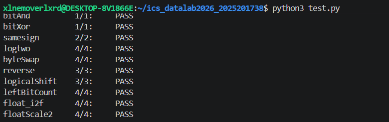
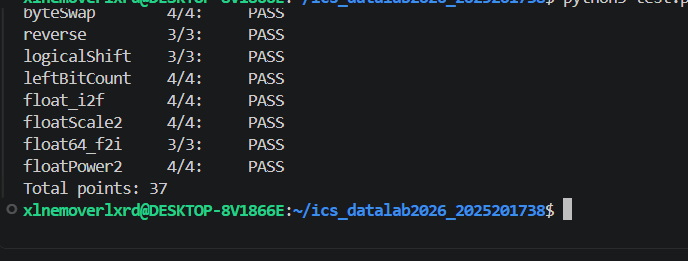

# datalab 报告

姓名：陈昱铭

学号：2025201738

| 总分    | bitAnd | bitXor | samesign | logtwo | byteSwap | reverse | logicalShift | leftBitCount | float_i2f | floatScale2 | float64_f2i | floatPower2 |
| ----- | ------ | ------ | -------- | ------ | -------- | ------- | ------------ | ------------ | --------- | ----------- | ----------- | ----------- |
| 37/37 | 1      | 1      | 2        | 4      | 4        | 3       | 3            | 4            | 4         | 4           | 3           | 4           |

test 截图：

## 解题报告

自己觉得写得比较顺的几个：

1. logtwo —— 二分找最高位那个思路，写完一次就过了
2. leftBitCount —— 前导连续1，也是二分，但比 logtwo 绕一点
3. floatPower2 —— 看着唬人，其实就是算阶码

### bitAnd & bitXor

第一题德摩根定律，`x&y = ~(~x|~y)`，没什么好说的。

bitXor 一开始写的是 `~(~(~x&y) & ~(x&~y))`，结果 dlc 报超 ops（8个>7个）。后来换成 `~(x&y) & ~(~x&~y)`，也就是先把 `x^y = (x|y) & ~(x&y)`，再用德摩根把 `|` 换成 `~ &`，刚好7个运算符。

### samesign

就是比两个数的最高位。题目说0不算正也不算负，所以要单独处理0的情况：两个都是0返回1，只有一个是0返回0，剩下的才去比符号位。

一开始写了 `!x || !y`，dlc 说不让用 `||`，改成嵌套 if 就好了。

### logtwo

这题卡了挺久。一开始用 `!!(v>>16)` 那种写法，dlc 说不能用 `!` 和 `+`（这题 Legal ops 只有 `> < >> << |`）。

后来想明白：直接用比较结果当0/1就行了。`(v > 0xFFFF)` 本身就是0或1，左移4位就是0或16，用 `|=` 累加（因为每一位不重叠，|和+等价），然后 `v >>=` 对应的位数。从16、8、4、2、1一路二分下来，就是最高位1的位置。

### byteSwap

把要交换的两个字节分别取出来（右移后 `&0xFF`），再用掩码把原来的两个字节位置清零，最后把两个字节换个位置或回去。`n<<3` 就是 n*8，算字节偏移。

### reverse

分治交换。先交换前后16位，然后在每个16位里交换高低8位，接着4位、2位、1位这样一层层换下去。就是几个固定掩码 `0xFF00FF00`、`0xF0F0F0F0` 之类的套进去。

### logicalShift

C 里 int 右移是算术右移，负数高位补1。要做逻辑右移就得把补出来的1擦掉。先正常右移 n 位，然后造一个掩码：高 n 位是0、低位全1，和结果按位与就行。掩码是 `~(((1<<31)>>n)<<1)`，n=0 的时候掩码是全1，结果不变，边界也对上了。

### leftBitCount

数从最高位开始连续有多少个1。也是二分：看高16位是不是全1，是的话 cnt+=16 再左移16位继续看，然后8、4、2、1。判断"全1"用 `!(~(x>>k))`——如果 k 位全1，取反就是0，再 `!` 就是1。

这里有个坑：32位全1的时候，二分 16+8+4+2+1=31，最后还剩一位没数到，所以多加了一步判断最后那一bit。

### float_i2f

int 转 float。先处理符号，取绝对值，找到最高位1在哪，阶码就是那个位置+127。然后把绝对值左移让最高位顶到第31位，取中间23位做尾数，剩下低8位做舍入（就近舍入到偶数）。进位溢出的时候阶码要+1。

### floatScale2

float 乘2就是阶码+1。但要分开处理：阶码全1（NaN/无穷）直接返回原值；阶码是0（非规格化）就得把尾数左移1位；正常情况阶码+1，加完变成全1就是无穷。

### float64_f2i

64位 double 转 int。double 是1位符号+11位阶码+52位尾数，uf2 高32位、uf1 低32位。算出来 e = 阶码-1023，e<0 返回0，e>=31 溢出返回 0x80000000。中间值根据 e 是不是超过20位，分别从 uf2 的低20位和 uf1 里拼整数部分，最后加上符号。

一开始用了 `unsigned long long` 来拼64位尾数，dlc 说不让用类型转换和 long long，就改成分两段32位拼了。

### floatPower2

求 2.0^x 的 float 表示。正常情况就是 `(x+127)<<23`。但要处理边界：x>=128 返回无穷 0x7F800000；x 在 -126 到 127 之间正常算；x 在 -149 到 -127 之间是非规格化数，对应尾数里某一位是1，`1 << (x+149)`；x 比 -149 还小就返回0。

这里一开始 x=2147483647 的时候 `x+127` 溢出成负数，判断写反了，改成直接比较 x 本身就好。

## 反馈/收获/总结

这个 lab 比想象中费时间，主要不是写算法，是 dlc 那个运算符检查特别烦，写完还得反复对着 Legal ops 删东西。位运算那块二分的思路挺有意思的，浮点数部分搞懂 IEEE754 格式之后其实就是拼 bit，不算太难。

## 参考的重要资料

- CSAPP 教材第2章（信息的表示和处理）
- B 站搜"CSAPP datalab"找了几个讲解视频对照着看
- 分治反转 bit 那个掩码是网上搜到的
